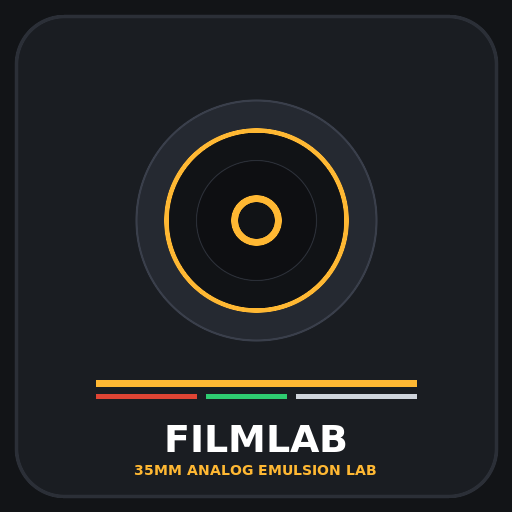
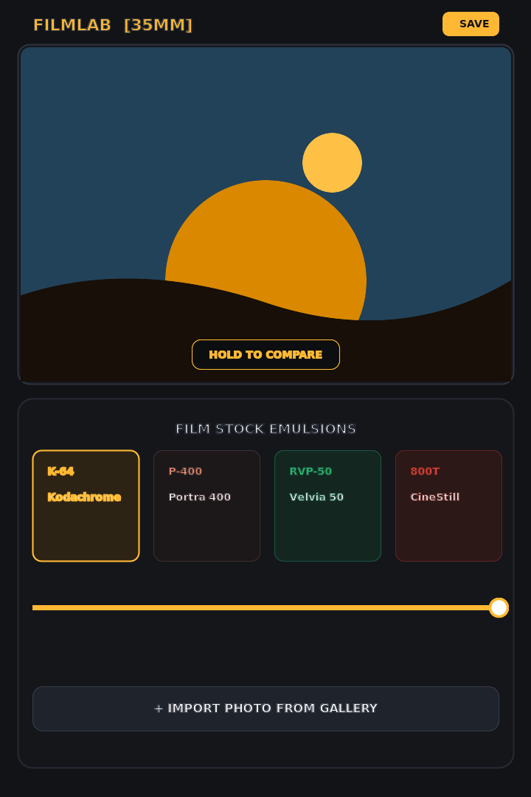

<div align="center">



# FilmLab
### Professional 35mm Analog Film Simulation Engine for Android

[](https://developer.android.com)
[](https://developer.android.com/jetpack/compose)
[](https://kotlinlang.org)
[](https://robolectric.org)
[](https://developer.android.com/guide/topics/large-screens/make-your-app-fold-aware)
[](https://developer.android.com)

*Authentic photochemical emulsion modeling, Hurter–Driffield sensitometry, optical halation bloom, and true crystalline silver halide grain physics.*

---



</div>

---

## Table of Contents

- [Overview](#overview)
- [The 7 Iconic Film Stocks](#the-7-iconic-film-stocks)
- [Key Features](#key-features)
- [How to Use FilmLab](#how-to-use-filmlab)
- [Foldable Phone Experience](#foldable-phone-experience)
- [Technical Architecture (For Contributors)](#technical-architecture-for-contributors)
  - [The Photochemical Simulation Engine](#the-photochemical-simulation-engine)
  - [Sensitometry & Grain Pipeline](#sensitometry--grain-pipeline)
  - [How to Add a New Film Stock](#how-to-add-a-new-film-stock)
  - [Building and Running Tests](#building-and-running-tests)
  - [Project Directory Structure](#project-directory-structure)
- [Privacy & Permissions](#privacy--permissions)

---

## Overview

Most modern digital photo filters merely overlay flat color tints or static 3D LUT cubes. Real photographic film behaves very differently: light passes through multiple chemical emulsion layers, silver halide crystals clump in midtones and shadows, dye couplers respond dynamically to spectral frequencies, and high-energy photons scatter across the camera pressure plate.

**FilmLab** brings the authentic physics of 35mm film development directly to your Android device. Every film stock is modeled using measured **Hurter–Driffield (H-D) characteristic density curves**, **spectral dye-coupling equations**, and **stochastic grain synthesis**.

---

## The 7 Iconic Film Stocks

FilmLab includes seven painstakingly calibrated emulsions spanning color slide reversal, color negative, motion picture, and classic black-and-white chemistry:

| Film Stock | Code | Chemistry | Tone & Color Science | Grain Character |
|:---|:---:|:---:|:---|:---|
| **Kodak Portra 400** | `P-400` | C-41 Negative | 12-stop exposure latitude, warm pastel skin tones, soft highlight roll-off, cool slate shadow neutralization. | Micro-fine tabular T-GRAIN crystals |
| **Kodachrome 64** | `K-64` | K-14 Reversal | Punchy Kodachrome contrast, warm golden-amber cast, deep cobalt/cerulean skies, and saturated crimson reds. | Organic subtractive dye clouds |
| **Fujifilm Velvia 50** | `RVP-50` | E-6 Slide | Ultra-high saturation, emerald greens, warm sunset magenta/amber, and razor-sharp landscape separation. | RMS-9 microscopic slide dye clouds |
| **CineStill 800T** | `800T` | C-41 Motion | Tungsten-balanced cool palette, lifted navy shadows, and iconic **optical red halation bloom** around specular lights. | Motion picture dye clouds + optical bloom |
| **Fujifilm Pro 400H** | `400H` | C-41 Negative | Signature 4th cyan-sensitive dye layer, ethereal mint greens, pastel tones, and luminous porcelain skin. | Soft, luminous fine-grain negative dye |
| **Ilford HP5 Plus** | `HP5+` | B&W Silver | Classic British photojournalism, gentle medium contrast, optical yellow filter tonal sky separation, deep D-Max. | Uniform cubic silver halide crystalline grain |
| **Kodak Tri-X 400** | `400TX` | B&W Silver (D-76) | Legendary street photography grit, punchy contrast, charcoal blacks, and distinct shadow separation. | Aggressive metallic silver filament clumps |

---

## Key Features

- **Standardized 35mm Lab Scan Geometry**: Normalizes input photos to 2048px on the long edge so that grain frequency accurately represents ~17.5µm per pixel, matching a physical 35mm film negative scan.
- **Physical Optical Halation Bloom**: Accurately simulates the absence of the anti-halation Remjet backing on CineStill 800T. Red-orange light bounces off the film pressure plate and bleeds back into the red-sensitive emulsion layer.
- **Hold-to-Compare Viewport**: Press and hold anywhere on the photo viewport to seamlessly inspect the unfiltered digital original against your developed emulsion.
- **Continuous Emulsion Intensity Dial**: Adjust the development strength smoothly from 0% (unprocessed digital baseline) to 100% (full analog chemical density).
- **Flawless Portrait & Landscape Framing**: Constraint-aware viewport dynamically scales vertical and horizontal photos to prevent UI overlap or distortion.
- **Calibrated Quick Test Scenes**: Includes three built-in test scenes (*Coastal Dusk*, *Street Shadows*, *Vintage Cafe*) to instantly test emulsions without needing immediate gallery photos.
- **Zero-Friction Gallery Export**: Saves high-resolution scans directly to your device's Pictures gallery using Android MediaStore.

---

## How to Use FilmLab

1. **Load a Photo**: Tap the camera icon or the **+ Import Photo** button to choose any image from your gallery using Android's secure Photo Picker. Alternatively, tap one of the quick test chips (*Coastal Dusk*, *Street Shadows*, or *Vintage Cafe*).
2. **Choose a Film Stock**: Swipe horizontally through the film stock carousel at the bottom of the screen. Each card displays the film's short code, ISO rating, process type, and color profile.
3. **Dial Intensity**: Drag the **Emulsion Intensity** slider to blend the analog effect to your liking.
4. **Compare**: Touch and hold the photo to temporarily reveal the unfiltered digital original. Release your finger to return to the film simulation.
5. **Inspect Film Details**: Tap the **(i)** icon in the top app bar to view detailed sensitometric notes and history for each film stock.
6. **Save**: Tap **SAVE** in the top bar to export the processed 35mm master photo to your Android gallery.

---

## Foldable Phone Experience

FilmLab is built from the ground up with **fold-aware layouts** for foldable devices (such as Samsung Galaxy Z Fold series, Google Pixel Fold, and Galaxy Z Flip):

```
       TABLETOP POSTURE (90° - 140°)                    BOOK POSTURE / EXPANDED
  ┌────────────────────────────────────┐         ┌──────────────────┬──────────────────┐
  │                                    │         │                  │  DARKROOM RACK   │
  │     DARKROOM MONITOR VIEWPORT      │         │     35mm SCAN    │  - Presets Dock  │
  │     (Full-bleed Upper Display)     │         │     VIEWPORT     │  - Intensity     │
  │                                    │         │                  │  - Test Scenes   │
  ├════════════════════════════════════┤ (Hinge) │                  │  - Export Actions│
  │        DARKROOM CONSOLE            │         │   (Left Pane)    │   (Right Pane)   │
  │   - Film Emulsion Carousel         │         │                  │                  │
  │   - Intensity Slider & Samples     │         └──────────────────┴──────────────────┘
  └────────────────────────────────────┘
```

- **Tabletop Posture (Half-Opened)**: When placed partially folded on a flat surface, FilmLab separates into an upper hands-free **Darkroom Monitor** and a lower tactile **Darkroom Developer Console**.
- **Book Posture & Large Tablets**: Automatically transitions to a side-by-side **Dual-Pane Darkroom** layout with zero letterboxing or awkward stretching.

---

## Technical Architecture (For Contributors)

FilmLab follows modern Android architecture principles with **Jetpack Compose (Material 3)**, **MVVM StateFlow pattern**, and a high-performance **Kotlin Coroutines Dispatcher engine**.

```
com.example
├── MainActivity.kt           // Entry point, window layout lifecycle
├── film
│   ├── FilmPreset.kt         // Film stock registry, color tokens, chemistry metadata
│   └── FilmEngine.kt         // Sensitometry LUTs, multi-threaded parallel pixel engine
└── ui
    ├── FilmLabScreen.kt      // Compose UI, responsive viewports, tabletop & dual-pane
    ├── FilmLabViewModel.kt   // Unidirectional state flow (FilmLabUiState)
    ├── FoldableState.kt      // Jetpack WindowManager fold tracker & posture detection
    ├── SamplePhotos.kt       // Procedural test scene generator
    └── theme                 // Material 3 darkroom palette & typography
```

### The Photochemical Simulation Engine

All film simulation mathematics are located in `FilmEngine.kt`. Image processing is executed across multiple CPU cores by dividing the bitmap scanlines into parallel chunks using `Dispatchers.Default`:

```kotlin
// FilmEngine.kt: Parallel chunk execution
val deferredJobs = (0 until numCores).map { coreIndex ->
    async {
        val startY = coreIndex * rowsPerCore
        val endY = if (coreIndex == numCores - 1) height else (coreIndex + 1) * rowsPerCore
        when (preset) {
            FilmPreset.PORTRA_400    -> processPortraChunk(...)
            FilmPreset.KODACHROME_64 -> processKodachromeChunk(...)
            FilmPreset.FUJI_VELVIA_50 -> processVelviaChunk(...)
            FilmPreset.CINESTILL_800T -> processCineStillChunk(...)
            FilmPreset.FUJI_PRO_400H  -> processPro400hChunk(...)
            FilmPreset.ILFORD_HP5    -> processIlfordHp5Chunk(...)
            FilmPreset.KODAK_TRI_X   -> processTriXChunk(...)
            FilmPreset.ORIGINAL      -> ...
        }
    }
}
deferredJobs.awaitAll()
```

### Sensitometry & Grain Pipeline

1. **Pre-computed Hurter–Driffield LUTs**: Non-linear toe and shoulder equations are computed once at startup into `IntArray(256)` tables:
   $$D = \frac{1}{1 + e^{-\gamma (\log E - \log E_0)}}$$
2. **Dye Coupling & Spectral Shifts**: Red, green, and blue dye coupler interactions model real-world spectral sensitivities (e.g. Kodak Portra orange mask compensation, Fuji 4th cyan dye layer, and Kodachrome yellow filter separation).
3. **Optical Halation Convolution**: CineStill's signature red halation uses an optimized 4x downscaled highlight threshold map, a multi-pass separable box blur bloom, and an exponential falloff addition into the red emulsion layer.
4. **Procedural Silver Halide & Dye Grain**: Fast 32-bit Xorshift PRNG generates organic, resolution-independent crystal structures weighted by local luminance density.

---

### How to Add a New Film Stock

Adding a new calibrated film stock to FilmLab is straightforward:

1. **Register the Preset** in `FilmPreset.kt`:
   ```kotlin
   MY_FILM(
       displayName = "My Film Stock",
       shortCode = "MFS",
       subtitle = "Vintage Portrait Emulsion",
       category = "COLOR NEGATIVE",
       isoRating = "ISO 200",
       chemistryInfo = "C-41 Modern Emulsion",
       grainDescription = "Fine organic silver halide texture",
       accentColor = MyFilmAccent,
       cardBgColor = MyFilmCardBg,
       borderColor = MyFilmBorder
   )
   ```

2. **Compute Characteristic LUTs** in `FilmEngine.kt`:
   Add your red, green, and blue tone curve arrays in `buildLookupTables()`.

3. **Implement Chunk Processing**:
   Create a dedicated `processMyFilmChunk(...)` function in `FilmEngine.kt` to handle color mathematics and grain generation.

4. **Add Unit & Sensitometry Tests**:
   Add test assertions in `ExampleRobolectricTest.kt` verifying color shifts, contrast curves, and output dimensions.

---

### Building and Running Tests

FilmLab uses Gradle with Kotlin DSL and Robolectric for fast local JVM testing:

```bash
# Compile the application
gradle assembleDebug

# Run all sensitometry and Robolectric unit tests
gradle :app:testDebugUnitTest
```

All 7 film stocks are verified by automated test suites validating color reproduction, highlight halation bloom, and resolution normalization.

---

### Project Directory Structure

```text
├── assets/
│   ├── logo.svg              // Vector app logo
│   ├── logo.png              // Rendered app badge
│   ├── screenshot.svg        // Vector UI diagram
│   └── screenshot.png        // Rendered mobile UI screenshot
├── app/
│   ├── src/main/java/com/example/
│   │   ├── MainActivity.kt
│   │   ├── film/
│   │   │   ├── FilmEngine.kt
│   │   │   └── FilmPreset.kt
│   │   └── ui/
│   │       ├── FilmLabScreen.kt
│   │       ├── FilmLabViewModel.kt
│   │       ├── FoldableState.kt
│   │       ├── SamplePhotos.kt
│   │       └── theme/
│   └── src/test/java/com/example/
│       └── ExampleRobolectricTest.kt
├── build.gradle.kts
└── settings.gradle.kts
```

---

## Privacy & Permissions

- **100% On-Device Processing**: No image data is ever uploaded to external servers or cloud services.
- **Zero Broad Storage Permissions**: FilmLab uses the modern Android Photo Picker (`PickVisualMedia`) and Android MediaStore API, requiring no legacy storage access permissions.
- **Telemetry-Free**: No analytics or user tracking.

---

<div align="center">
Crafted with passion for analog photography and modern Android engineering.
</div>
